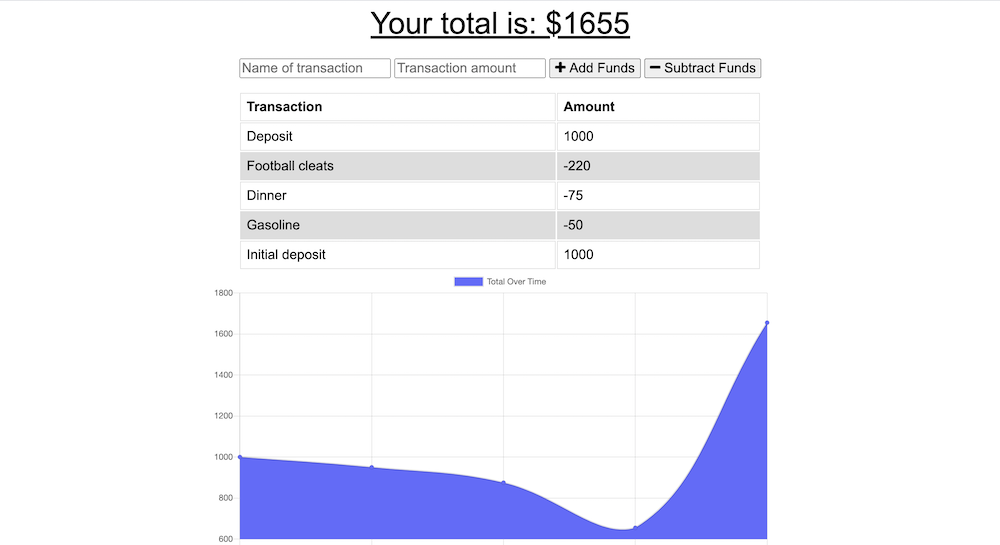
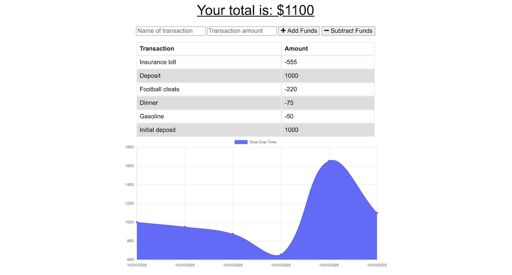
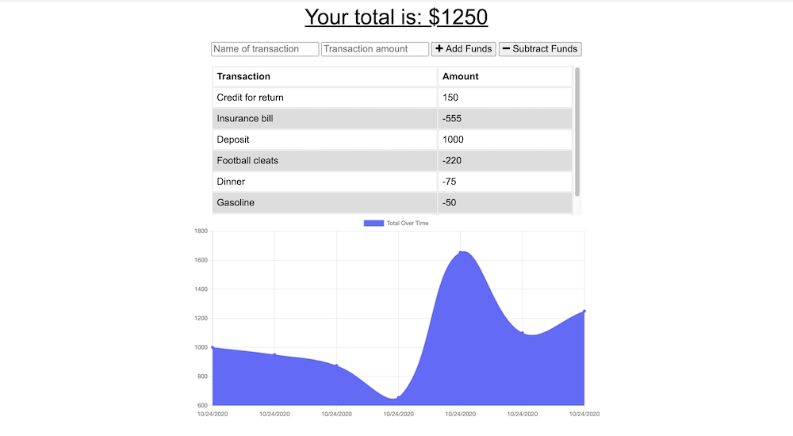
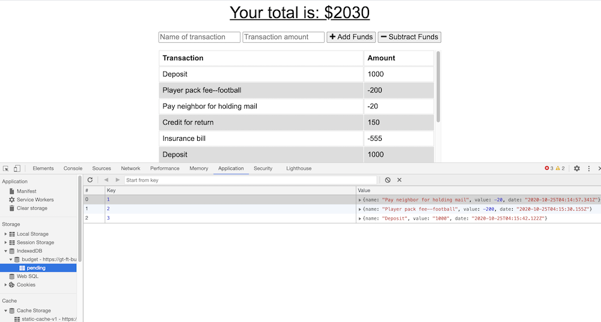
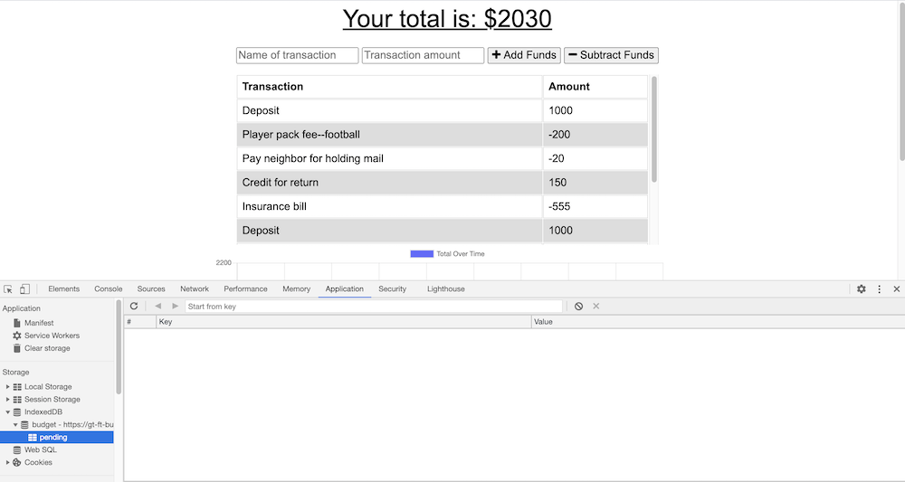

# budget-tracker

# Workout-Tracker

## Table of Contents
#### &nbsp;&nbsp;&nbsp;&nbsp;[1)&nbsp;Introduction](#introduction)
#### &nbsp;&nbsp;&nbsp;&nbsp;[2)&nbsp;Instructions](#instructions)
#### &nbsp;&nbsp;&nbsp;&nbsp;[3)&nbsp;Features](#features)
#### &nbsp;&nbsp;&nbsp;&nbsp;[4)&nbsp;Usage](#usage)
#### &nbsp;&nbsp;&nbsp;&nbsp;[5)&nbsp;Contributing](#contributing)
#### &nbsp;&nbsp;&nbsp;&nbsp;[6)&nbsp;License](#license)
#### &nbsp;&nbsp;&nbsp;&nbsp;[7)&nbsp;Questions](#questions)   

## Introduction 

Our task here was to add functionality to an existing Budget Tracker application to allow for offline access and functionality.  This means that a user will be able to add expenses and deposits to their budget with or without a connection.  When entering transactions offline, they will update the total current balance when brought back online.

## Instructions

Type NPM install in the terminal after cloning this repo and then npm install lite-server --save-dev.  From there a user has access to the functionality and can begin by adding a balance to their budget.  Subsequent entries for payments and credits and additional deposits will update the balance.  

## Features

Should the internet connection go out, as it frequently does at our house thanks to a much outdated local power grid infrastructure which still relies on above ground power lines subject to many falling trees during storms, a user can still use this app offline.  Their balance will update automatically when the internet eventually comes back.  When our city joins the 21st century and buries power lines underground, this feature will no longer be as necessary for us.

## Usage

The URL for this project is https://gt-ft-budget-tracker.herokuapp.com/

The URL for this project's GitHub repository is: https://github.com/7J647/budget-tracker

Screenshot 1:  Initial balance
 

 
Screenshot 2:  Debit (payment) example

 
Screenshot 3:  Credit (deposit) example

 
Screenshot 4:  Three offline transactions showing as pending

 
Screenshot 5:  Pending transactions updated to database when back online

## Contributing

With thanks to Head Coach Jonathan Watson for his class demo on this assignment. 

## License

MIT License

Copyright (c) 2020 Jeff Flynn

Permission is hereby granted, free of charge, to any person obtaining a copy
of this software and associated documentation files (the "Software"), to deal
in the Software without restriction, including without limitation the rights
to use, copy, modify, merge, publish, distribute, sublicense, and/or sell
copies of the Software, and to permit persons to whom the Software is
furnished to do so, subject to the following conditions:

The above copyright notice and this permission notice shall be included in all
copies or substantial portions of the Software.

THE SOFTWARE IS PROVIDED "AS IS", WITHOUT WARRANTY OF ANY KIND, EXPRESS OR
IMPLIED, INCLUDING BUT NOT LIMITED TO THE WARRANTIES OF MERCHANTABILITY,
FITNESS FOR A PARTICULAR PURPOSE AND NONINFRINGEMENT. IN NO EVENT SHALL THE
AUTHORS OR COPYRIGHT HOLDERS BE LIABLE FOR ANY CLAIM, DAMAGES OR OTHER
LIABILITY, WHETHER IN AN ACTION OF CONTRACT, TORT OR OTHERWISE, ARISING FROM,
OUT OF OR IN CONNECTION WITH THE SOFTWARE OR THE USE OR OTHER DEALINGS IN THE
SOFTWARE.

## Questions

Connect with me at Github: <a href="https://github.com/7J647">7J647</a> &nbsp;&nbsp;&nbsp;&nbsp;
Contact me via Email: [jeffreyedwardflynn@gmail.com](mailto:jeffreyedwardflynn@gmail.com)
